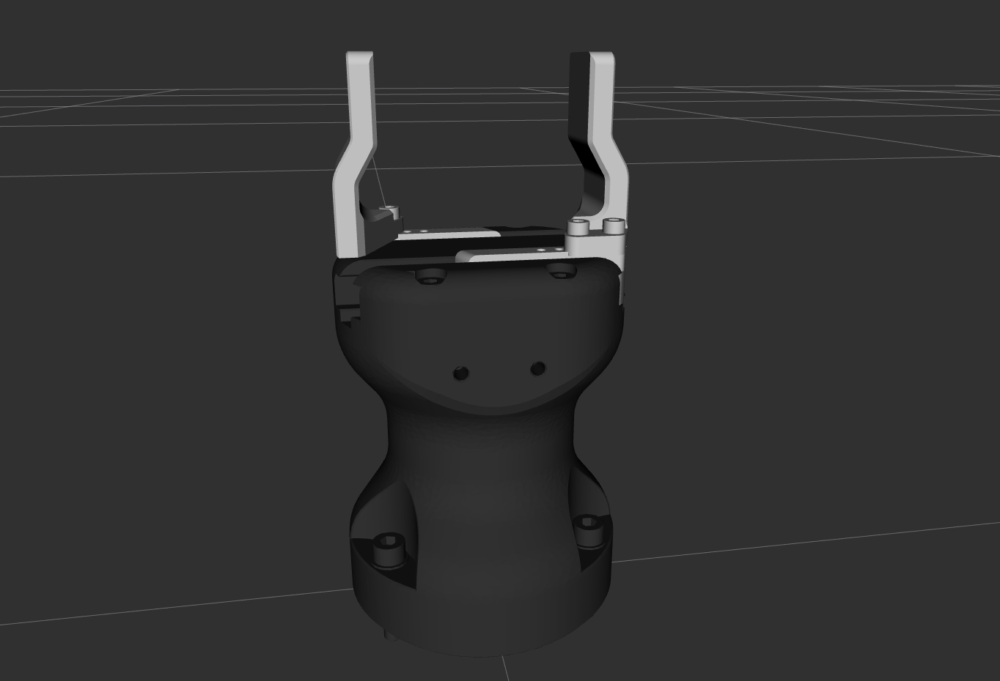
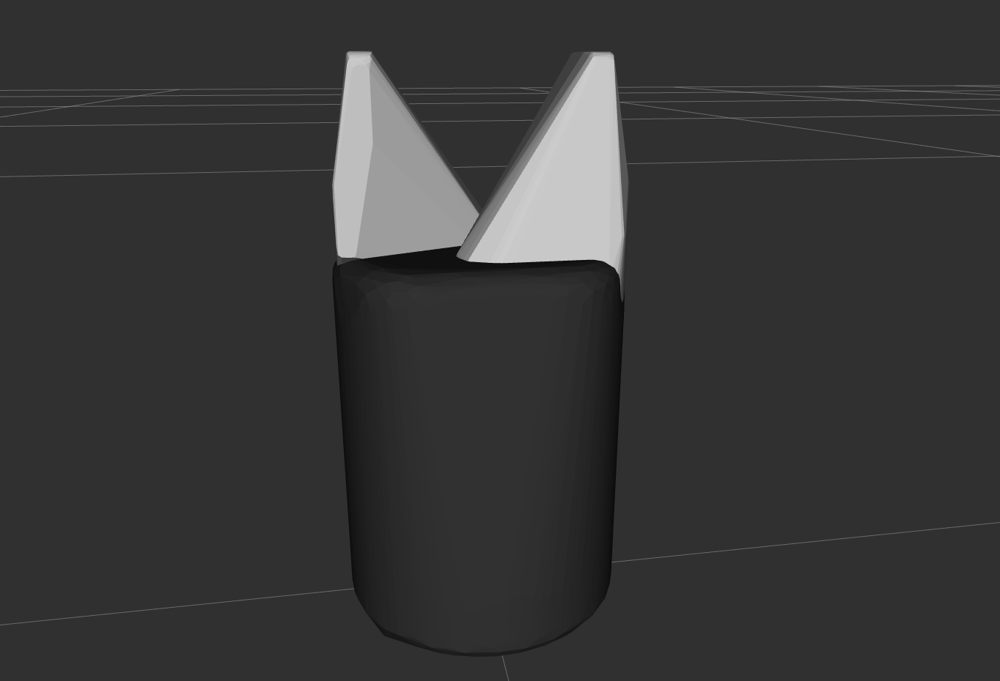

# hand-e

[](http://rosindustrial.org/news/2016/10/7/better-supporting-a-growing-ros-industrial-software-platform)


ROS2 Humble Hawksbill package for Robotq Hand-E gripper.

## Dependency (tested as a host machine)

- [Ubuntu 22.04 PC](https://ubuntu.com/certified/laptops?q=&limit=20&vendor=Dell&vendor=Lenovo&vendor=HP&release=22.04+LTS)
  - Docker 26.1.1
  - Docker Compose 2.27.0

## Installation

```bash
git clone git@github.com:takuya-ki/hand-e.git --recursive --depth 1 && cd hand-e && COMPOSE_DOCKER_CLI_BUILD=1 DOCKER_BUILDKIT=1 docker compose build --no-cache --parallel 
```

## Usage

1. Build and run the docker environment
   - Create and start docker containers in the initially opened terminal
        ```bash
        docker compose up
        ```
   - Execute the container in another terminal
        ```bash
        xhost + && docker exec -it hande_humble_container bash
        ```
2. Build program files with the revised yaml
    ```bash
    cd /ros2_ws && colcon build --symlink-install --parallel-workers 1 && source install/setup.bash
    ```
3. Run a planning process in the container
   - Use byobu to easily command several commands  
        ```bash
        byobu
        ```
        - First command & F2 to create a new window & Second command ...
        - Ctrl + F6 to close the selected window
   - Display the robot's (visual and collision) models
        ```bash
        ros2 launch hande_tutorials display.launch.py
        ```
        - Robot Visual  
            
        - Robot Collision  
            
   - Run the hand closing and opening demonstrations in simulations
        ```bash
        ros2 launch hande_tutorials demo.launch.py is_sim:=True
        ```
   - Run the hand closing and opening demo in the real world  
        ```bash
        ros2 launch hande_tutorials demo.launch.py is_sim:=False
        ```


## Contributors

We always welcome collaborators!

## Author / Contributor

[Takuya Kiyokawa](https://takuya-ki.github.io/)
