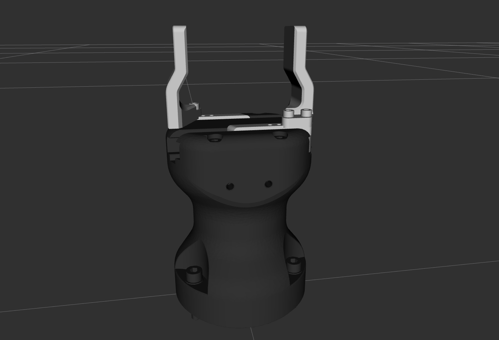
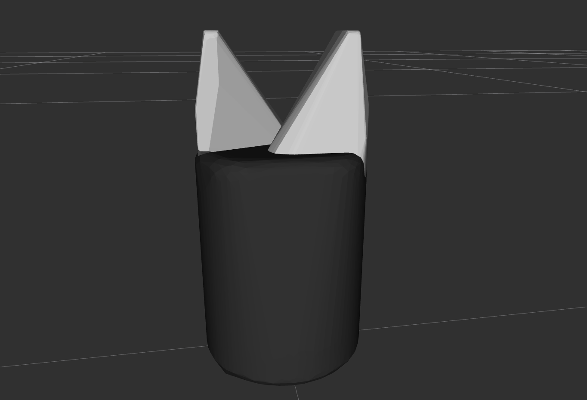

# Robotiq Hand-E-Adaptive-Gripper 

This package contains the URDF files describing the hand-e gripper from robotiq.

To test the gripper URDF description type 

```
roslaunch robotiq_2f_hande_visualization test_2f_hande_model.launch 
```
## Robot Visual
  

## Robot Collision 
  
